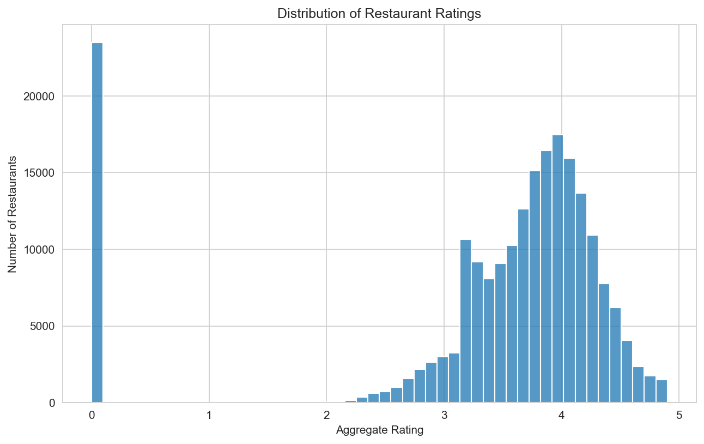
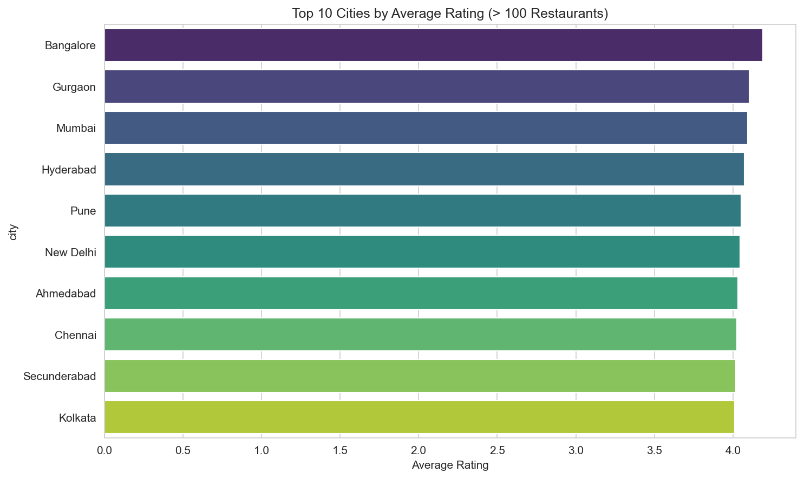
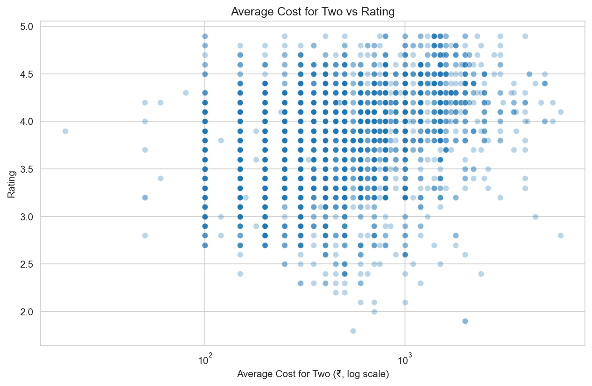

# Zomato India - Restaurant Analysis

An end-to-end dataanalysis project explorin restaurant trends across Indian cities using zomato dataset.

## Thesis

using Zomato's India restaurant dataset, this project investigates: how do ratings and prices actually distribute across Indian cities, where do data biases distort our view, and which cities, cuisines, and establishment types reveal patterns worth deeper analysis.

## Tech Stack
- **Languages:** Python, SQL
- **Libraries:** pandas, numpy, matplotlib, seaborn
- **Database:** PostgeSQL *(in progress)*
- **Visualization:** Power BI / Tableau *(planned)*

## Dataset

- **Source:** [Zomato Restaurants in India](https://www.kaggle.com/datasets/rabhar/zomato-restaurants-in-india) by 'rabhar' on Kaggle
- **Size:** 211,944 rows x 26 columns (cleaned to 22 columns)
- **Coverage:** 99 India cities

> **Important data coveat:** The dataset shows scraping biases - Chennai (11,630 restaurants) has nearly 2x more entities than Mumbai (6,497), which does not reflect actual Zomato presence in India.

## Business Questions

1. What % of restaurants are zero-rated (unrated), and does vary by city?
2. Which Indian cities have highest-rated restaurants (filteres to rated)?
3. Which localities have the highest concentration of top-rated restaurants?
4. Which cuisine dominate which cities? Are there regional cuisine signatures?
5. For chain restaurants present in multiple cities, how much does pricing vary?
6. Which restaurant attributes (delivery, AC, alcohol, pure-veg) correlate with higher ratings?
7. Which cities have low engagement - low votes-per-restaurant despite many restaurants?
8. Does higher average cost correlate with higher ratings? How much does the Variance change?
9. Where are the "hidden gems" - high rating but low vote count?
10. How does pricing vary by establishment type (Quick Bites vs Fine Dining vs Bar)?

## DAta Cleaning Decisions

- Re-read source CSV with UTF-8 encoding (not latin-1) to correctly handle "café" and similar characters.
- Dropped 'zipcode' (77% missing), 'url' (not analytical), 'country_id' and 'currency' (constant), and 'takeaway' (100% '-1', no information).
- Parsed stringified list columns ('establishment') into clean string using 'ast.literal_eval'.
- Converted '-1' values in 'delivery' to 'NaN' (these mean "unknown", not "no").

## Key Findings

### 1. The rating distribution is bimodal: a tall spike at 0, then a normal hump around 4.0

11.1% of restaurants (23,478 of 211,944) have a rating of exactly 0 — they have never been rated. Among rated restaurants, ratings cluster between 3.3 and 4.1, with a median of **3.80** and a mean of 3.82. The naive overall mean of 3.40 is misleading because it includes zero-rated restaurants. **Takeaway:** when reporting "typical" ratings, use the median of rated restaurants, not the mean of everything.

### 2. The "best" cities by rating cluster within a tiny 0.20-point band

Bangalore leads at 4.20; Kolkata at #10 sits at 4.00. The entire top 10 fits within a 0.20-point window. Visually this looks like a clear ranking, but the differences are too small to be meaningful as a quality ordering. A better follow-up: weight by vote count, or examine variance instead of just mean.

### 3. Price doesn't *raise* ratings — it raises the floor

Low-cost restaurants (₹50–200 for two) show the full rating spectrum from 2.0 to 4.9. But for restaurants costing more than ₹1,000 for two, ratings below 3.0 nearly vanish. The relationship is not "expensive = higher rated" — it's "expensive = more *consistent*." Cheap restaurants are hit-or-miss; expensive ones have a quality floor. Caveats: selection effects (who pays for expensive meals, who bothers rating) likely contribute.

## Project Structure
zomato-india-analysis/
├── data/
│   ├── raw/              # Original Kaggle CSV (gitignored)
│   └── processed/        # Cleaned dataset
├── notebooks/
│   ├── 01_initial_exploration.ipynb
│   ├── 02_data_cleaning.ipynb
│   └── 03_exploratory_analysis.ipynb
├── sql/                  # Analytical SQL queries (coming)
├── src/                  # Reusable Python scripts (coming)
├── dashboards/           # Charts and Power BI / Tableau files
├── requirements.txt
└── README.md

## Setup

1. Clone this repo
2. Create virtual env: `python -m venv venv` then activate (`venv\Scripts\activate` on Windows, `source venv/bin/activate` on Mac/Linux)
3. Install dependencies: `pip install -r requirements.txt`
4. Download the dataset from [Kaggle](https://www.kaggle.com/datasets/rabhar/zomato-restaurants-in-india), extract, and place CSV at `data/raw/zomato_india.csv`
5. Run notebooks in order (01 → 02 → 03)

## Status

Days 1–3 complete: setup, cleaning, initial EDA. PostgreSQL setup and SQL analysis next.

## Author

**Gautam Singh Rawat** — [LinkedIn](https://linkedin.com/in/gautam-rawat-862769256) · [GitHub](https://github.com/Gautam-Rawat)

