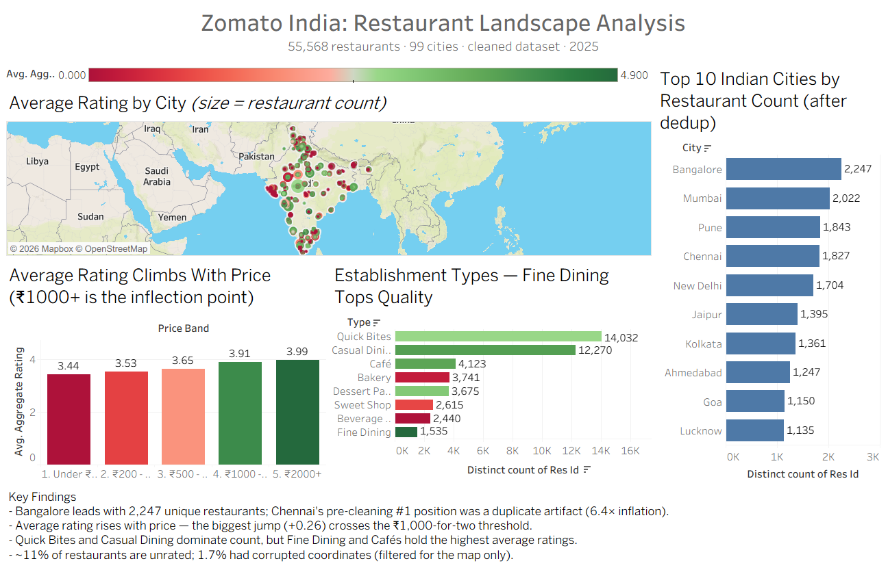

# Zomato India — Restaurant Landscape Analysis

End-to-end data analysis of 211,944 restaurants across 99 Indian cities using Zomato's open dataset. The project covers data cleaning, SQL-based analysis in PostgreSQL, and interactive visualization in Tableau, with explicit attention to data quality issues that affect how results should be interpreted.

## Live Dashboard

**[View the interactive dashboard on Tableau Public →](https://public.tableau.com/views/ZomatoIndia-RestaurantLandscapeAnalysis/Dashboard1?:language=en-US&:sid=&:redirect=auth&:display_count=n&:origin=viz_share_link)**



## Thesis

How does India's restaurant landscape really look once the data is properly cleaned? This project investigates pricing patterns, rating distributions, regional cuisine signatures, and chain pricing strategies — while quantifying the data quality issues that distort naive analysis. The most important finding is methodological: 73.7% of the raw dataset was duplicate rows that required removal before any meaningful analysis could begin.

## Tech Stack

- **Languages:** Python, SQL
- **Libraries:** pandas, numpy, matplotlib, seaborn, SQLAlchemy
- **Database:** PostgreSQL 17
- **Visualization:** Tableau Public
- **Environment:** python-dotenv for secrets, virtualenv for dependencies

## Dataset

- **Source:** [Zomato Restaurants in India](https://www.kaggle.com/datasets/rabhar/zomato-restaurants-in-india) by `rabhar` on Kaggle
- **Raw size:** 211,944 rows × 26 columns
- **Cleaned size:** 55,568 unique restaurants × 22 columns
- **Coverage:** 99 cities across India

## Business Questions

This project answers ten specific questions, each mapped to one or more SQL queries and visualizations:

1. What percentage of restaurants are zero-rated (unrated), and how does this vary by city?
2. Which Indian cities have the highest-rated restaurants (filtered to rated entries)?
3. Which localities have the highest concentration of top-rated restaurants?
4. Which cuisines dominate which cities? Are there regional cuisine signatures?
5. For chain restaurants present in multiple cities, how much does pricing vary?
6. Which restaurant attributes correlate with higher ratings?
7. Which cities have low engagement — low votes per restaurant despite many restaurants?
8. Does higher average cost correlate with higher ratings? How does variance change?
9. Where are the "hidden gems" — high rating but low vote count?
10. How does pricing vary by establishment type (Quick Bites vs Fine Dining vs Bar)?

## Data Cleaning Decisions

Every cleaning choice is documented in `notebooks/02_data_cleaning.ipynb`. Summary:

- **Encoding:** Source CSV re-read with UTF-8 (not latin-1) to correctly render characters like `Café`.
- **Dropped columns:** `zipcode` (77% null), `url` (not analytical), `country_id` and `currency` (constants), and `takeaway` (100% `-1`, no information).
- **Parsed stringified lists:** the `establishment` column was stored as `"['Quick Bites']"` (a string that looks like a list). Used `ast.literal_eval` to safely parse into clean string values.
- **Missing value semantics:** `-1` values in `delivery` were converted to `NaN` since they represent "unknown" rather than "no."
- **Deduplication:** removed 156,376 duplicate rows by `res_id`, reducing the dataset from 211,944 to 55,568 unique restaurants. See Data Quality Findings below.

## Data Quality Findings

Three distinct data quality issues were discovered during analysis. Documenting these is critical because they directly affect how results should be interpreted.

### 1. Duplicate rows: 73.7% of raw data

The raw dataset contained 211,944 rows but only 55,568 unique restaurants (by `res_id`). **156,376 rows (73.7%) were duplicates**, with individual Chennai restaurants appearing up to 169 times each. This duplication was heavily concentrated in Chennai, which is why pre-cleaning city counts overstated Chennai by 6.4× and ranked it #1 with 11,630 restaurants. Post-dedup, Chennai ranks #4 with 1,827 actual unique restaurants.

| Rank | Raw data | Cleaned |
|------|----------|---------|
| 1 | Chennai (11,630) | Bangalore (2,247) |
| 2 | Mumbai (6,497) | Mumbai (2,022) |
| 3 | Bangalore (4,971) | Pune (1,843) |
| 4 | Pune (4,217) | Chennai (1,827) |
| 5 | Lucknow (4,121) | New Delhi (1,704) |

### 2. Corrupted coordinates: 1.7% of restaurants

957 restaurants (1.7% of cleaned data) had corrupted geographic coordinates — latitude or longitude equal to 0, placing them at "Null Island" off the coast of West Africa. This is a common scraping failure pattern. These rows were filtered from the geographic visualization but retained for non-spatial analyses where city name is sufficient.

### 3. Missing establishment type: 3.3% of restaurants

1,830 restaurants (3.3%) had an empty list `"[]"` for the `establishment` field, which `ast.literal_eval` parsed to `NULL`. Excluded from establishment-type analyses, retained elsewhere.

## Key Analytical Findings

### Ratings cluster around a left-skewed distribution with a tall zero spike

11.1% of restaurants have a rating of exactly 0 — they have never been rated. Among rated restaurants, ratings cluster between 3.3 and 4.1 with a median of **3.80** and a mean of 3.82. The naive overall mean of 3.40 is misleading because it includes zero-rated entries. **When reporting "typical" ratings, use the median of rated restaurants, not the mean of everything.**

### Weighted ratings outperform simple ratings in every major city

Restaurants with more votes are rated higher on average — popularity and quality move together. Bangalore's simple average rating is 4.19; weighted by votes it rises to 4.49. This pattern holds across all top cities and means simple averages systematically understate the quality of popular restaurants.

### Average rating climbs with price; biggest jump at the ₹1,000 threshold

Average rating rises monotonically with price band: ₹50–199 → 3.44, ₹200–499 → 3.53, ₹500–999 → 3.65, ₹1000–1999 → 3.91, ₹2000+ → 3.99. The single biggest jump (+0.26) occurs between bands 3 and 4 — something about crossing ₹1,000 for two changes the experience meaningfully.

### International chains standardize pricing; Indian chains vary wildly

Across chains operating in 5+ cities, international franchises show remarkably consistent pricing (KFC 2.4% coefficient of variation, Burger King 6.7%, McDonald's 7.8%). Indian chains, by contrast, vary dramatically (Indian Coffee House 50.2%, Mocha 29.4%, Lassi Shop 28.8%). Franchise discipline vs. local flexibility — visible in the data.

### Unrated restaurants concentrate in tourist towns

The cities with the highest share of unrated restaurants are overwhelmingly hill stations and tourist destinations: Palakkad, Alappuzha, Darjeeling, Pushkar, Gangtok, Srinagar, Nainital, Ooty, Mussoorie, Shimla, Manali. This is not random — it indicates Zomato's rating activity is concentrated among metro users; tourist towns appear in the dataset but lack the engaged user base to generate ratings.

## Project Structure

zomato-india-analysis/
├── data/
│   ├── raw/                          # Original Kaggle CSV (gitignored)
│   └── processed/
│       └── zomato_clean.csv          # Deduped, cleaned data
├── notebooks/
│   ├── 01_initial_exploration.ipynb
│   ├── 02_data_cleaning.ipynb        # All cleaning decisions documented
│   └── 03_exploratory_analysis.ipynb # EDA + initial visualizations
├── sql/
│   ├── 00_sanity_checks.sql
│   ├── 01_zero_rated_by_city.sql
│   ├── 02_top_cities_weighted.sql
│   ├── 03_hidden_gems.sql
│   ├── 04_price_bands.sql
│   └── 05_chain_pricing.sql
├── src/
│   └── load_data.py                  # Loads cleaned CSV into PostgreSQL
├── dashboards/
│   ├── dashboard_preview.png         # Static preview of Tableau dashboard
│   └── *.png                         # Individual chart exports
├── .env                              # DB credentials (gitignored)
├── .gitignore
├── requirements.txt
└── README.md

## Setup

1. **Clone the repository**
```bash
   git clone https://github.com/Gautam-Rawat/zomato-india-analysis.git
   cd zomato-india-analysis
```

2. **Create and activate a virtual environment**
```bash
   python -m venv venv
   # Windows
   venv\Scripts\activate
   # macOS/Linux
   source venv/bin/activate
```

3. **Install dependencies**
```bash
   pip install -r requirements.txt
```

4. **Download the dataset** from [Kaggle](https://www.kaggle.com/datasets/rabhar/zomato-restaurants-in-india) and place the CSV at `data/raw/zomato_india.csv`.

5. **Run the notebooks in order** (01 → 02 → 03) to reproduce cleaning and EDA.

6. **(Optional) Load into PostgreSQL** for SQL analysis:
   - Install PostgreSQL 17, create a database named `zomato_india`
   - Copy `.env.example` to `.env` and fill in your credentials
   - Run `python src/load_data.py`
   - Run queries from the `sql/` folder in pgAdmin or psql

## Author

**Gautam Singh Rawat**
[LinkedIn](https://linkedin.com/in/gautam-rawat-862769256) · [GitHub](https://github.com/Gautam-Rawat) · gautamrawat2910@gmail.com